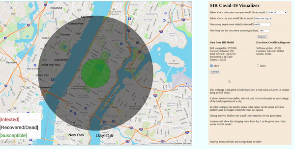

# SIR Covid-19 Visualizer-Hack The North East
A repository for all our code worked on during Hack The North East Hack-a-thon to build our SIR Covid-19 Visualizer. This was a 72 virtual Hack-a-thon that was the first Hack-a-thon that we had ever participated in. We also had never worked with front end development before so this project was used to get a better idea of how to use basic systems to show complex Ideas. The SIR model that we used was an extension of a basic Differential Equations model that was covered in our colleges Diff Equ class.

## [Pandemic Simulator](https://pandemicsimulator.neocities.org/)

## Contents
* **SIR_FORM**: The final app we built. It uses JS to implement a simple SIR model solved with the Euler method. It is broken up into a script file and a style sheet as well as an HTML layout file.  
* **dev**: a folder for all of the intermediate steps in the project.
  * **api call**: a file to test the api calls we made to the api we used.
  * **Brainstorm**: a list of the ideas that we wanted to incorporate in the project.
  * **Circles**: a file to experiment drawing with canvas in HTML5.
  * **map**: a file that helped test for map api we used.
  * **OPA**: a sample image that we used for a temporary image for testing.
  * **Simple Adder**: a basic HTML page to help us figure our form inputs.
  * **SIRmodel**: an attempt to translate the SIR model to JS
  * **SIRmodelTesting**: a basic exploration of the SIR model from a programmatic standpoint.
  * **SIRmodelwithvacine**: a more advanced model we were unable to implement due to time constraints.
  * **style**: a style sheet used to experiment with different style elements.
  * **tester**: a basic webpage that was used to test models.  
  * **tester Canvas**: this was used to specifically test the ability to animate and write on JS canvas.
  
## Purpose
This project was built as a way to visualize the spread of infectious diseases, especially Covid-19 using easy-to-understand graphics. To do this, we used an SIR model, which is one of the simplest differential equations models for diseases. The name SIR comes from Susceptible, Infected and Recovered, which are the three compartments the model uses.

## Usage:
To use this website, users must enter four pieces of information:
  1. The city they want to model
  2. The disease they want to model (Only Covid-19 is currently implemented with accurate data)
  3. How many people were infected at day 1?
  4. How long has the virus been spreading?

In order to compare the SIR model numbers with the real-life data for Covid-19 tracking, users can click the 'retrieve' button, which will show the statistics for the inputted information. In order to view this data on the map, select the checkbox immediately beneath this data to change the map view.

The 'animate' button creates a short animation from day 1 to the inputted day showing how the various sections of the model change over time.
## Credits
* **This project was created by**:
  * @jem2000
  * @pequode
* **API's used**
  * https://api.covidtracking.com
  * https://api.mapbox.com/
